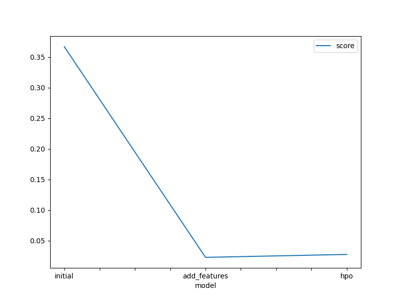
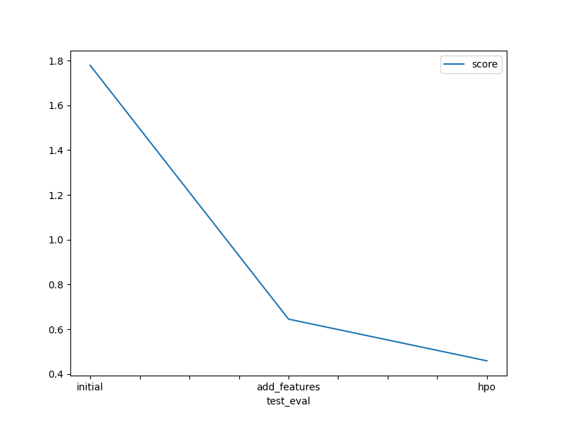

# Report: Predict Bike Sharing Demand with AutoGluon Solution
#### Ikechi Ndukwe

## Initial Training
### What did you realize when you tried to submit your predictions? What changes were needed to the output of the predictor to submit your results?
I realized that when I tried to submit my predictions, output of the predictor was a Pandas Series so, I had to change the output into a Pandas Dataframe using the .to_frame() method.

### What was the top ranked model that performed?
The top ranked model that performed was Weighted_Ensemble_L3.

## Exploratory data analysis and feature creation
### What did the exploratory analysis find and how did you add additional features?
The exploratory data analysis helped to visualize how the data was distributed. The additional feature I added was the hour of the day which was extracted from the datetime column of the data.

### How much better did your model preform after adding additional features and why do you think that is?
My model went from having a Root Mean Squared Logarithmic Error (RMSLE) of 1.77824 to 0.64517 after adding an additional feature. I think the results improved because, the hour of the day when the bike was rented played an important role in helping the model predict more accurately.

## Hyper parameter tuning
### How much better did your model preform after trying different hyper parameters?
My model went from having a Root Mean Squared Logarithmic Error (RMSLE) of 0.64517 to 0.45895 after trying different hyperparameters.

### If you were given more time with this dataset, where do you think you would spend more time?
If I was given more time with this dataset, I would spend more time exploring the data to potentially find additional features that would help the model perform better.

### Create a table with the models you ran, the hyperparameters modified, and the kaggle score.
|model|hpo1|hpo2|hpo3|score|
|--|--|--|--|--|
|initial|WeightedEnsemble_L3 | RandomForestMSE_BAG_L2 | ExtraTreesMSE_BAG_L2 | 1.77824|
|add_features|WeightedEnsemble_L3 | ExtraTreesMSE_BAG_L2 | RandomForestMSE_BAG_L2 | 0.64517|
|hpo|WeightedEnsemble_L3 | ExtraTreesMSE_BAG_L1 | WeightedEnsemble_L2 | 0.45895|

### Create a line plot showing the top model score for the three (or more) training runs during the project.

### Create a line plot showing the top kaggle score for the three (or more) prediction submissions during the project.

## Summary
AutoGluon is a very useful and powerful library every Machine Learning Engineer should know how to use.
